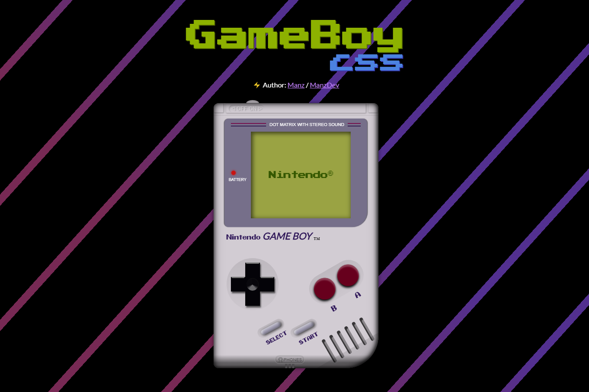

# GameBoy CSS

A Visual/Interactive Nintendo GameBoy using HTML, CSS, Javascript & WebComponents.

Created by **[@Manz](https://twitter.com/Manz)**

Others demos: https://manzdev.github.io/

#### Tools & libraries

- Native technologies: [HTML](https://lenguajehtml.com/), [CSS](https://lenguajecss.com/) & [Javascript](https://lenguajejs.com/) (cheatsheets here!)
- WebComponents using Google [LitElement](https://lit-element.polymer-project.org/)
- Powered with PostCSS, Babel, ESLint, Stylelint, Prettier and Parcel.
- [HowlerJS](https://howlerjs.com/) for music
- [DatGUI](https://github.com/dataarts/dat.gui) for interactive widget
- [Audacity](https://www.audacityteam.org/), free sound editor
- [create-lit-app](https://gist.github.com/ManzDev/f36766103a69a54fa6f1c7cc7ff98355), my own script for create LitElement app scaffold

#### Fonts

- [Terminator 2: Judgment Day (Mega Drive) by Patrick Lauke](https://fontstruct.com/fontstructions/show/1536530/terminator-2-judgment-day-mega-drive)
- [Pretendo](http://www.abstractfonts.com/font/11800?text=Nintendo)
- [Press Start 2P](https://fonts.google.com/specimen/Press+Start+2P)
- [Lato](https://fonts.google.com/specimen/Lato)

#### Images & Music

- Original game from **Terminator 2: Judgment day** for _Nintendo GameBoy_.
- Original music from **Terminator 2: Judgment day** from _David Whittaker_.
